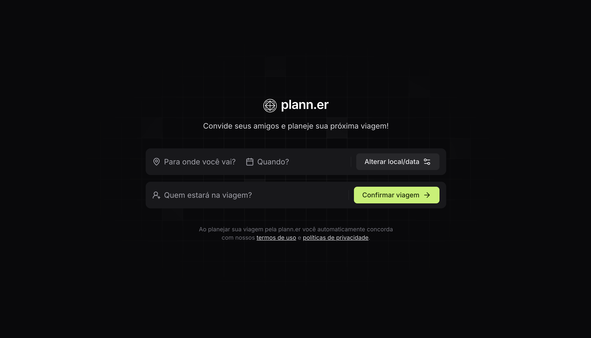
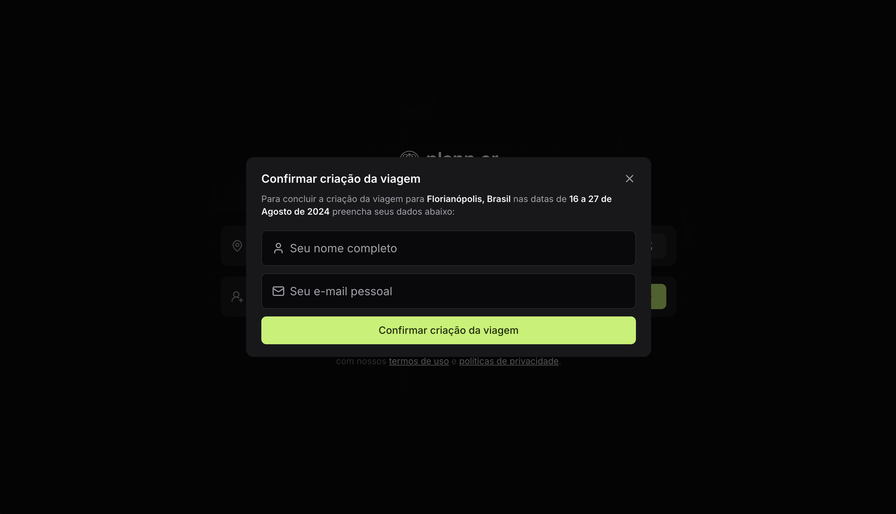
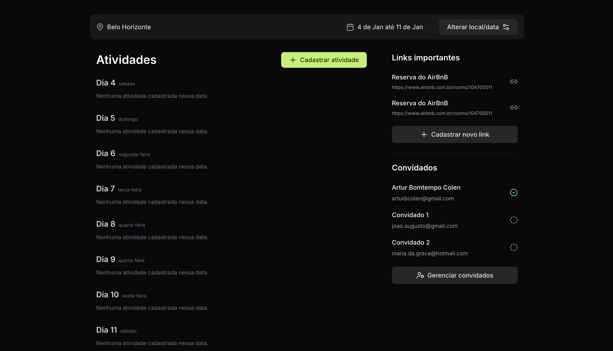
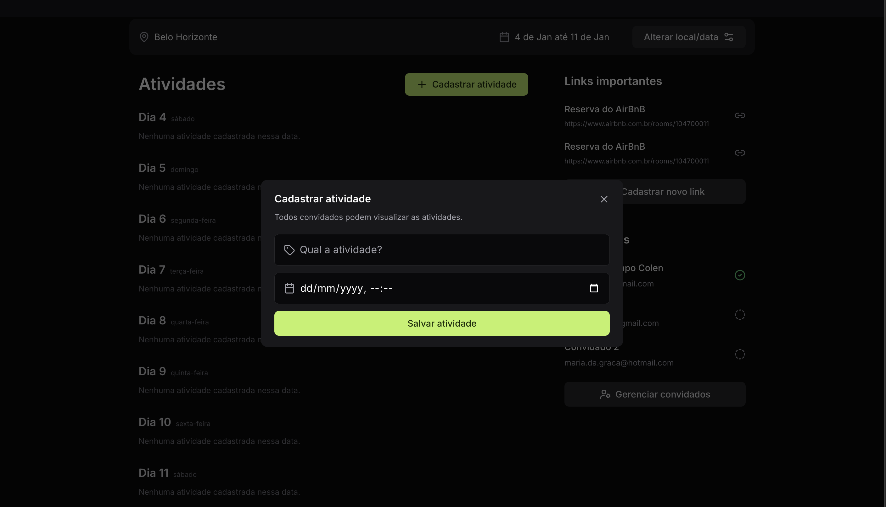

<div  align="center" id="about">
	<h1 align="center">
        plann.er
    </h1>
    <p align="center">
        The project is a complete travel itinerary platform with front-end and back-end components. Its primary goal is to simulate a system for scheduling and managing trips, offering features such as activity tracking and participant management. This project was developed during the NLW Journey, a Rocketseat event, as a way to enhance knowledge of web development using Node.js and TypeScript.
    </p>
	
</div>
<br>
<div align="center">
    <a href="https://github.com/nodejs" target="_blank"></a>
    <a href="https://github.com/SpaceForDevelopment/Convert2Base-Package" target="_blank"></a>
    <a href="https://convert2base.vercel.app/" target="_blank"></a>
    <a href="https://github.com/SpaceForDevelopment/Convert2Base-Package/blob/main/LICENSE.md" target="_blank"></a>
</div>

<a id="table-of-contents"></a>

## 📋 Table of Contents

-   [About](#about)
-   [Table of Contents](#table-of-contents)
-   [Features](#features)
-   [Application Demonstration](#application-demonstration)
-   [Setup and Run the Application](#setup-and-run-the-application)
-   [Technologies](#technologies)
-   [Author](#author)
-   [License](#license)

<a id="features"></a>

## 📝 Features

All API routes for the listed features have been fully developed and are functional. However, as this project is for educational purposes, some features were not implemented in the front-end during the course and currently have no timeline for implementation. Below is a detailed list of the features, indicating which ones have been implemented and which ones remain unavailable on the front-end.

-   [x] Travel registration
-   [x] Travel activity registration
-   [x] Creation of travel invitations
-   [x] Travel confirmation
-   [x] Participant confirmation
-   [x] Travel details listing
-   [x] Participants listing
-   [ ] Travel data update
-   [ ] Manage registered guests
-   [ ] Registration of important travel links
-   [ ] Listing of important travel links

<a id="application-demonstration"></a>

## 📲 Application Demonstration

Below, you will find example images of the application’s front-end, showcasing its main screens and highlighting its interface and core functionalities. Additionally, you can access the API documentation for detailed information about the available routes. To view the documentation, [click here](https://nlw-journey.apidocumentation.com/reference).

-   Trip Creation



-   Confirm Trip Creation



-   Trip Details



-   Register Trip Activity



<a id="setup-and-run-the-application"></a>

## 📁 Setup and Run the Application

### ⚙️ Prerequisites

Before starting, you need to have the following tools installed on your machine: [Git](https://git-scm.com) and [Node.js](https://nodejs.org/en).

It’s also recommended to use a code editor like [VSCode](https://code.visualstudio.com/).

### 🚀 How to Run the Application

#### Front-End Setup

```bash
# Clone this repository
$ git clone https://github.com/ArturColen/plann.er.git

# Navigate to the client folder
$ cd client

# Install dependencies
$ npm install

# Run the application in development mode
$ npm run dev

# The front-end will start on port 5173 - access <http://localhost:5173>
```

#### Back-End Setup

```bash
# Open a new terminal and navigate to the server folder
$ cd server

# Install dependencies
$ npm install

# Create the database file
$ npx prisma db push

# Copy the contents of the .env.example file to a new .env file
$ cp .env.example .env

# Run the server in development mode
$ npm run dev

# The server will start on port 3333 - it should log `Server is running on port 3333`
```

<a id="technologies"></a>

## 💻 Technologies

The following tools were used in the development of this project:

-   [Node.js](https://nodejs.org/docs/latest/api/)
-   [TypeScript](https://www.typescriptlang.org/docs/)
-   [React.js](https://react.dev/learn)
-   [Axios](https://axios-http.com/docs/intro)
-   [Tailwind CSS](https://v2.tailwindcss.com/docs)
-   [Fastify](https://fastify.dev/docs/latest/)
-   [Prisma](https://www.prisma.io/docs)
-   [Nodemailer](https://www.nodemailer.com/)
-   [Day.js](https://day.js.org/docs/en/display/format)
-   [Zod](https://zod.dev/)

<a id="author"></a>

## 👨🏻‍💻 Author

---

| [<br><sub>Artur Bomtempo</sub>](https://github.com/ArturColen) |
| :-----------------------------------------------------------------------------------------------------------------------------------------------------: |

Developed by Artur Bomtempo 👋🏽. Get in touch:

[](mailto:arturbcolen@gmail.com)
[](https://www.linkedin.com/in/artur-bomtempo/)
[](https://www.instagram.com/arturbomtempo.dev/)

<a id="license"></a>

## 📜 License

Copyright (c) 2025 Artur Bomtempo Colen

Permission is hereby granted, free of charge, to any person obtaining a copy
of this software and associated documentation files (the "Software"), to deal
in the Software without restriction, including without limitation the rights
to use, copy, modify, merge, publish, distribute, sublicense, and/or sell
copies of the Software, and to permit persons to whom the Software is
furnished to do so, subject to the following conditions:

The above copyright notice and this permission notice shall be included in all
copies or substantial portions of the Software.

THE SOFTWARE IS PROVIDED "AS IS", WITHOUT WARRANTY OF ANY KIND, EXPRESS OR
IMPLIED, INCLUDING BUT NOT LIMITED TO THE WARRANTIES OF MERCHANTABILITY,
FITNESS FOR A PARTICULAR PURPOSE AND NONINFRINGEMENT. IN NO EVENT SHALL THE
AUTHORS OR COPYRIGHT HOLDERS BE LIABLE FOR ANY CLAIM, DAMAGES OR OTHER
LIABILITY, WHETHER IN AN ACTION OF CONTRACT, TORT OR OTHERWISE, ARISING FROM,
OUT OF OR IN CONNECTION WITH THE SOFTWARE OR THE USE OR OTHER DEALINGS IN THE
SOFTWARE.
